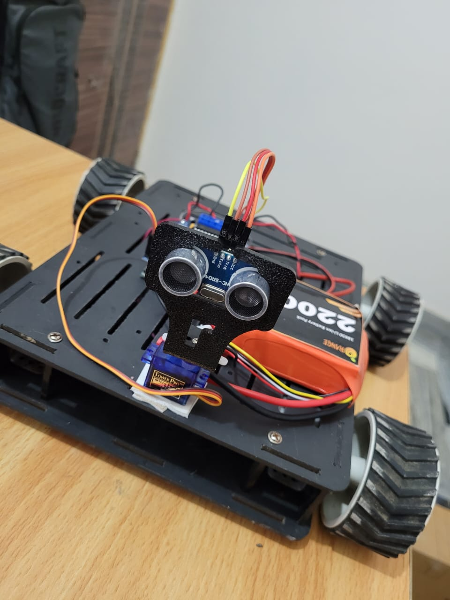
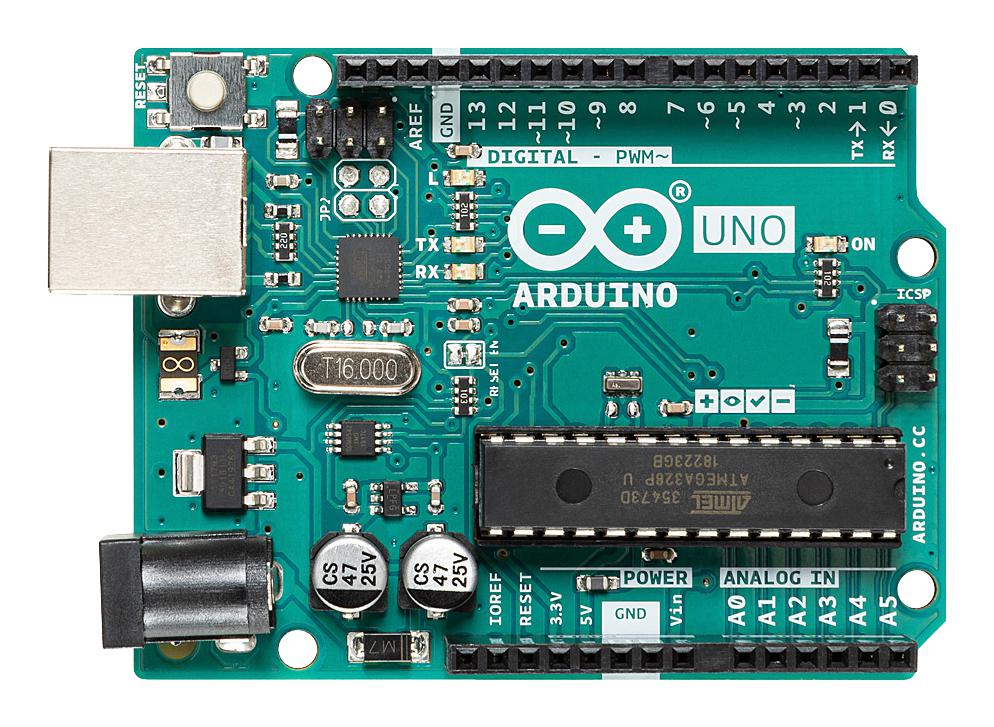
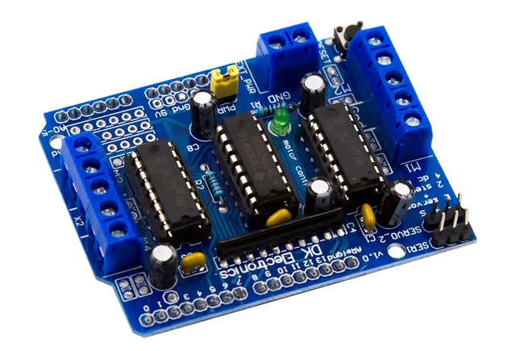
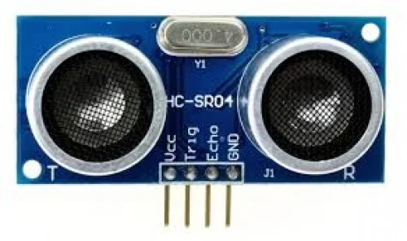
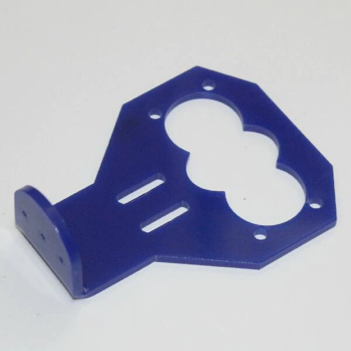
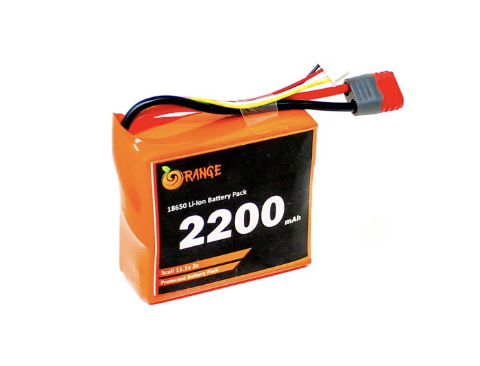

# Obstacle avoiding car with arduino

# Components

## Arduino Uno

## L293D Motor Shield

## Ultrasonic sensor (HC-SR04)

## Ultrasonic sensor mount

## Servo motor (SG90)

## Battery (orange Li-ion 2200mah 2S1P 2c battery pack)

## 12v metal motors

